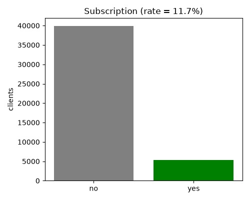
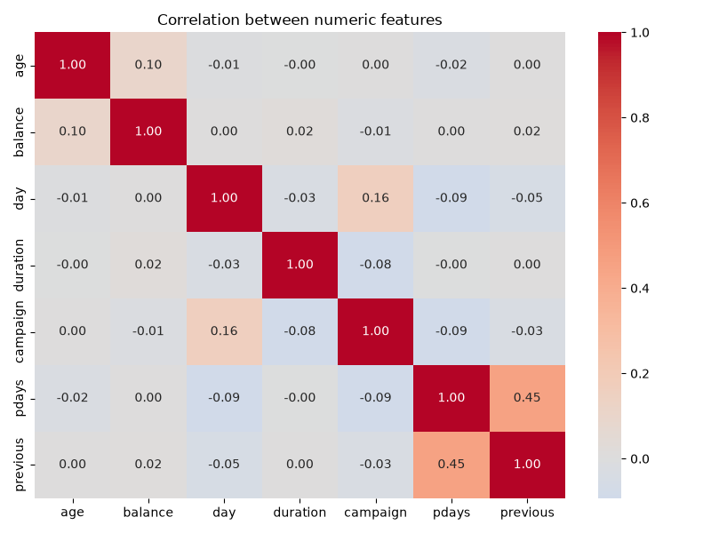
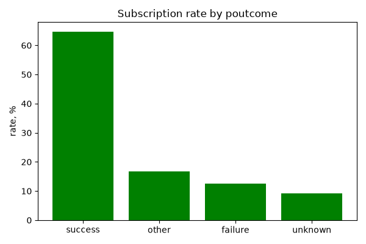
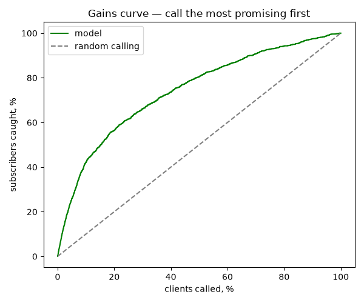

# Bank Marketing — Data Analysis

A simple, beginner-friendly analysis of the **UCI Bank Marketing** dataset.
The question: *which clients subscribe to a term deposit after a marketing
call, and what is related to that decision?*

The script (`bank_marketing_analysis.py`) goes top to bottom:

1. Load the data.
2. Quick check — missing values, duplicates, `"unknown"` categories.
3. Target — how many clients subscribed (the classes are imbalanced).
4. Numeric features — means per class and a correlation heatmap.
5. Categorical features — subscription rate and *lift* per group.
6. A simple logistic-regression model with ROC-AUC and the top features.
7. Cross-validation and comparison with a dummy baseline and a random forest.
8. A business view — a *gains curve* showing how many subscribers we catch
   if we call the most promising clients first.
9. Save every result table to `results.xlsx` (one sheet per table).

## Source / dataset

Dataset: **[UCI Bank Marketing](https://archive.ics.uci.edu/dataset/222/bank+marketing)**
(`bank-full.csv`, 45,211 contacts, 16 features + target `y`).

The dataset is **not** included in this repository (see `.gitignore`).
Download it from the link above and place it so the script finds it:

```
bank-marketing-analysis/
└── bank/
    └── bank-full.csv
```

## How to run

```bash
pip install -r requirements.txt
python bank_marketing_analysis.py
```

The script can be run from any folder — it switches to its own directory first,
loads `bank/bank-full.csv`, prints the results, saves charts to `figures/`, and
writes all result tables to `results.xlsx` (one sheet per table).

## Note on `duration`

The `duration` (call length) column is dropped before training the model,
because it is only known *after* the call finishes. Using it would let the model
"cheat", so it is excluded to keep the result realistic.

## Figures

| | |
|---|---|
|  |  |
|  |  |

## Results (on a hold-out / cross-validation)

- Logistic regression: **ROC-AUC ≈ 0.77** (cross-validated, stable across folds).
- Random forest: **ROC-AUC ≈ 0.78** — a little better, confirms the choice is reasonable.
- Dummy baseline: **0.50** — the models clearly beat random.
- **Business takeaway:** calling the top **20%** of clients by predicted probability
  catches about **56%** of all subscribers (top 50% → ~81%).
